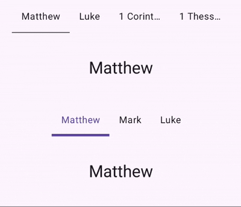
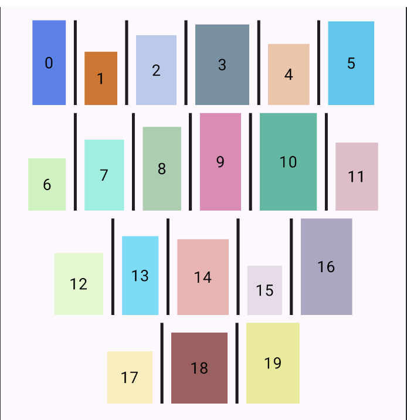
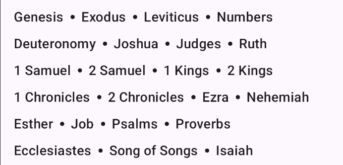
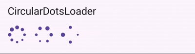
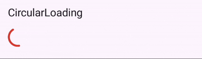
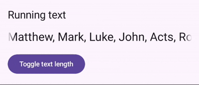
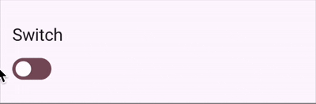
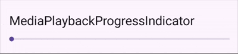

# ComposeComponents

A collection of reusable, customizable Jetpack Compose UI components for Android applications. This repo provides a set of well-designed components that can be easily integrated into your Compose-based projects.

## 🎨 Components

### 1. **TabRow**
A horizontal tab row that integrates seamlessly with `PagerState` for tab navigation.

**Features:**
- Animated indicator width and position based on the current page and swipe offset.
- Click-to-navigate functionality
- User scrolling can be enabled/disabled.
- Supports custom indicator color, thickness, and content for each tab.

  


### 2. **SeparatedFlowRow**
A FlowRow component with customizable separators between items, providing flexible layout options.

**Features:**
- Lays out children in horizontal rows with automatic wrapping.
- Supports **custom composable separators** between items (defaults to a vertical divider).
- Configurable horizontal and vertical spacing, and vertical alignment per item.
<p float="left">
  
  
</p>


### 3. **CircularDotsLoader**
A loading indicator featuring animated dots in a circular pattern.

**Features:**
- Circular loader with multiple dots arranged in a circle.
- Each dot scales up and down in sequence to create a rotating effect.
- Number of dots, animation duration, color, and minimum scale are customizable.

  


### 4. **CircularLoading**
An animated circular loading indicator with rotating motion, expanding arcs, and cycling colors. Perfect for loading states with a modern, dynamic appearance.

**Features:**
- Smooth arc expansion and contraction animation
- Continuous rotation
- Cycles through multiple colors (default Google-style colors).
- Adjustable stroke width

  


### 5. **ModalBottomSheet**
A customizable modal bottom sheet with enhanced dragging and scrolling behavior.

**Problems it solves compared to Material3 `ModalBottomSheet`:**
- **Fast drag on small sheets:** Material3 sheets can be aggressively overdragged up when the sheet is small; this component fixes that for smoother dragging.
- **Scrim animation:** Applies scrim (background dim) animation depending on sheet visibility for smoother transitions.
- **Padding support:** Allows padding from the bottom and sides of the screen, which Material3 sheets don’t natively support.

**Features:**
- **Drag handle support:** Accepts a custom drag handle composable.
- **Dismiss callback:** `onDismissRequest` called when the sheet is dismissed.
- **Customizable properties:** Fully configurable through `ModalBottomSheetProperties`.
- **Smooth dragging behavior:** Works reliably for both small and large sheets without snapping issues.

  


### 6. **RunningText**
A single-line text composable that automatically scrolls horizontally (marquee effect) when text exceeds the container width.

**Features:**
- Automatic overflow detection
- Smooth horizontal scrolling
- Fade-out edges for polished appearance
- Full Text styling support

  


### 7. **Switch**
A customizable switch component with support for custom colors and styling.

- A custom toggle switch.
- Thumb can be dragged and animates its scale when interacted with.
- Fully customizable colors, thumb diameter, and padding.

  


### 8. **MediaPlaybackProgressIndicator**
A specialized progress indicator designed for media playback scenarios with customizable colors and styling.

**Features:**
- A horizontal media progress bar with draggable thumb.
- Animates the thumb scale when dragging (`indicatorDotTappedScale`) and supports cooldown for user interaction (`userInteractionCooldownMillis`) — useful for media players where the progress is updated by an external source like a service.
- Fully customizable colors and thumb content.

  


## 📱 Demo App

The project includes a demo app (`MainActivity`) that showcases all components. Run the app to see each component in action with interactive examples.


### Installation

1. Clone the repository:
```bash
git clone https://github.com/yourusername/CoreCompose.git
```

2. Open the project in Android Studio (Hedgehog or later recommended)

3. Sync Gradle files

4. Run the app on an emulator or physical device


#### Adding Components to Your Project

1. **Copy the component files** from `app/src/main/java/com/danielyan/coreCompose/components/` into your project's source directory.

2. **Copy any dependencies** - Make sure your project includes the same Compose dependencies (see `gradle/libs.versions.toml` for version details).

3. **Import and use** the components in your Compose code.


#### Example Usage

For detailed usage examples of each component, see the demo implementations in `app/src/main/java/com/danielyan/coreCompose/componentsDemo/`. Each component has a corresponding demo file (e.g., `CircularLoadingDemo.kt`, `RunningTextDemo.kt`, etc.) that demonstrates how to use and customize the component.

You can also run the demo app (`MainActivity`) to see all components in action with interactive examples.


## 📁 Project Structure

```
CoreCompose/
├── app/
│   ├── src/
│   │   └── main/
│   │       ├── java/com/danielyan/coreCompose/
│   │       │   ├── components/          # Reusable components
│   │       │   │   ├── bottomSheet/
│   │       │   │   ├── mediaPlaybackProgressIndicator/
│   │       │   │   ├── separatedFlowRow/
│   │       │   │   ├── switchC/
│   │       │   │   └── tabRow/
│   │       │   ├── componentsDemo/     # Demo screens for each component
│   │       │   └── ui/theme/           # Theme configuration
│   │       └── res/                     # Resources
│   └── build.gradle.kts
├── gradle/
│   └── libs.versions.toml              # Dependency versions
└── build.gradle.kts
```


## 🤝 Contributing

Contributions are welcome! Please feel free to submit a Pull Request. For major changes, please open an issue first to discuss what you would like to change.

1. Fork the repository
2. Create your feature branch (`git checkout -b feature/AmazingFeature`)
3. Commit your changes (`git commit -m 'Add some AmazingFeature'`)
4. Push to the branch (`git push origin feature/AmazingFeature`)
5. Open a Pull Request


## 👤 Author

**Artur Danielyan**

- GitHub: [@arthurdanielyan](https://github.com/arthurdanielyan)


## 🙏 Acknowledgments

- Built with [Jetpack Compose](https://developer.android.com/jetpack/compose)
- Material Design 3 components

---

⭐ If you find this project helpful, please consider giving it a star!
